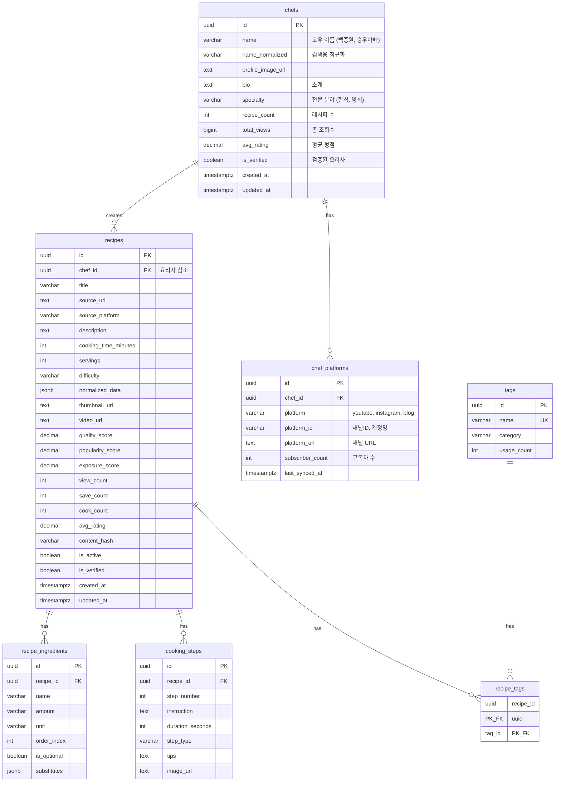
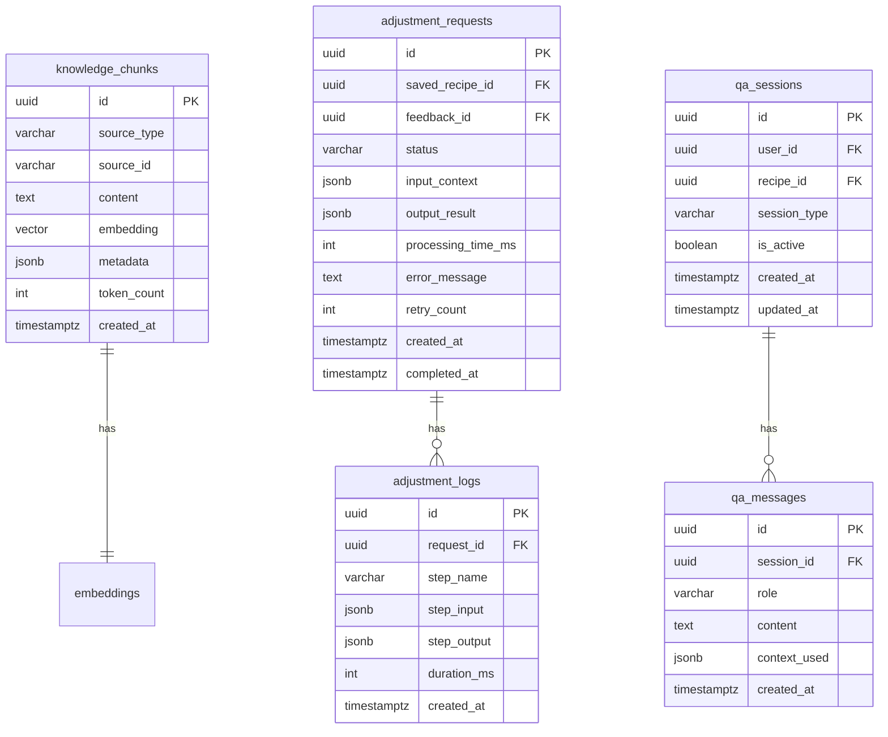
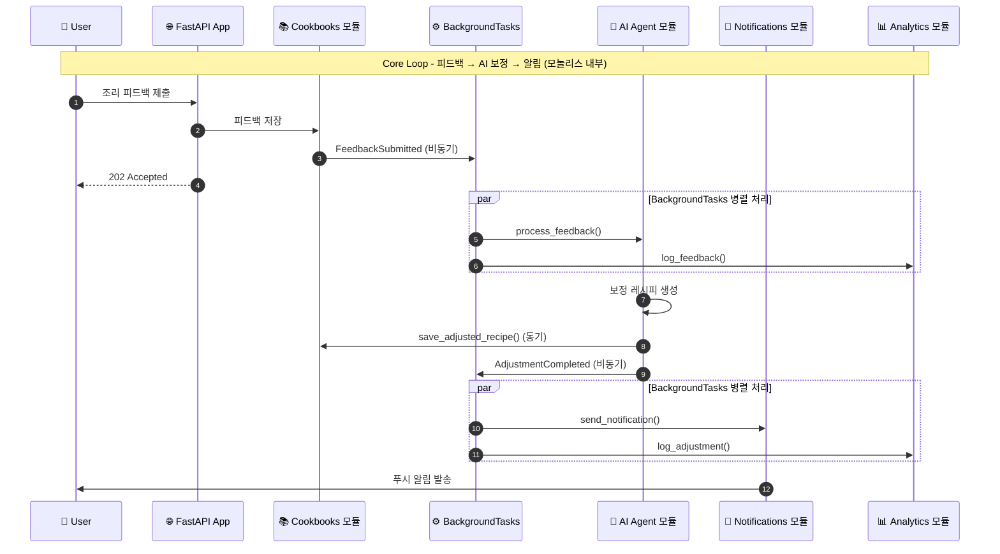

# SPECKIT_TODO.md - 내시피(Naecipe) 백엔드 스펙 구현 계획

이 문서는 spec-kit 워크플로우를 사용하여 FastAPI 백엔드를 단계적으로 구현하기 위한 스펙 분리 계획입니다.

---

## 개요

**프로젝트**: 내시피(Naecipe) - AI 기반 맞춤형 레시피 보정 서비스
**Core Loop**: 검색 → 레시피 상세 → 조리/사용 → 피드백 입력 → AI 보정 → 보정 레시피 저장
**아키텍처**: 모듈러 모놀리스 (v2.0, 2025.12.10)

**백엔드 모듈 목록** (단일 FastAPI 앱 내 도메인 모듈):
| 모듈 | 경로 | 역할 |
|------|------|------|
| recipes | `app/recipes/` | 원본 레시피 CRUD, 검색 |
| users | `app/users/` | 인증, 사용자 관리 |
| cookbooks | `app/cookbooks/` | 레시피북, 저장된 레시피, 피드백, 보정 레시피 |
| ai_agent | `app/ai_agent/` | LangGraph 기반 AI 처리 |
| knowledge | `app/knowledge/` | 벡터 임베딩, 검색 |
| notifications | `app/notifications/` | 푸시, 이메일 발송 |
| analytics | `app/analytics/` | 이벤트 집계, 통계 |
| ingestion | `app/ingestion/` | 크롤링 레시피 수신, 중복 검사 |

> **⚠️ v2.0 변경 (2025.12.10)**
> - 9개 독립 서비스 → 1개 앱 + 8개 도메인 모듈
> - 5개 PostgreSQL → 1개 PostgreSQL (스키마 분리: recipes, users, cookbooks, knowledge)
> - gRPC → Python 함수 호출
> - Kafka → BackgroundTasks (필요시 SQS)
> - EKS → ECS Fargate

---

## 핵심 용어 정의

> ⚠️ **중요**: 아래 용어를 명확히 구분하여 사용해야 합니다.

### 레시피 관련 용어

| 용어 | 영문 | 정의 | 관리 서비스 |
|------|------|------|-------------|
| **원본 레시피** | Original Recipe | 크롤링·수집·제휴 등을 통해 확보된, 사용자가 수정하기 전 상태의 서비스 내 레시피 자산. 모든 사용자에게 동일하게 제공됨. | Recipe Service |
| **보정 레시피** | Adjusted Recipe | 사용자의 피드백을 기반으로 AI가 생성한, 원본 레시피의 변형 버전. 사용자별로 개인화됨. | Cookbook Service |
| **레시피 버전** | Recipe Version | 보정 레시피의 히스토리. 한 사용자가 동일 레시피를 여러 번 보정할 때 생성됨. | Cookbook Service |

### 요리사 관련 용어

| 용어 | 영문 | 정의 | DB 테이블 |
|------|------|------|-----------|
| **요리사** | Chef | 레시피를 만든 원작자. 셰프, 인플루언서, 유튜버, 블로거 등 고유명사로 관리. | `chefs` |
| **요리사 플랫폼** | Chef Platform | 요리사가 활동하는 플랫폼 정보. 한 요리사가 여러 플랫폼(유튜브, 인스타, 블로그)을 가질 수 있음. | `chef_platforms` |

### 레시피북 관련 용어

| 용어 | 영문 | 정의 | DB 테이블 |
|------|------|------|-----------|
| **레시피북** | Cookbook | 사용자가 저장한 레시피들의 컬렉션(폴더). 하나의 사용자는 여러 레시피북을 가질 수 있음. | `cookbooks` |
| **저장된 레시피** | Saved Recipe | 레시피북에 저장된 원본 레시피 참조 + 개인 메모 + 보정 레시피들. | `saved_recipes` |
| **조리 기록** | Cooking Record | 사용자가 특정 레시피를 실제 조리에 사용했다고 표시한 단위. | `cooking_records` |
| **조리 피드백** | Cooking Feedback | 조리 후 사용자가 제출한 평가 및 보정 요청. AI 보정의 트리거. | `cooking_feedbacks` |

### 데이터 흐름 다이어그램

```
┌─────────────────────────────────────────────────────────────────────┐
│                        app/recipes/ 모듈                             │
│  ┌─────────────────────────────────────────────────────────────────┐ │
│  │  원본 레시피 (Original Recipe)                                   │ │
│  │  - 크롤링/수집된 레시피 데이터                                    │ │
│  │  - 모든 사용자에게 동일하게 제공                                  │ │
│  │  - 읽기 전용 (사용자 수정 불가)                                   │ │
│  └─────────────────────────────────────────────────────────────────┘ │
└─────────────────────────────────────────────────────────────────────┘
                                    │
                                    │ 저장 (Python 함수 호출)
                                    ▼
┌─────────────────────────────────────────────────────────────────────┐
│                       app/cookbooks/ 모듈                            │
│  ┌─────────────────┐    ┌─────────────────┐    ┌─────────────────┐  │
│  │   레시피북       │    │   저장된 레시피   │    │   보정 레시피    │  │
│  │   (Cookbook)    │───▶│  (Saved Recipe) │───▶│ (Adjusted Recipe)│  │
│  │                 │    │                 │    │                 │  │
│  │ - 사용자별 폴더  │    │ - 원본 레시피 참조│    │ - AI가 생성      │  │
│  │ - 이름, 설명    │    │ - 개인 메모      │    │ - 사용자별 개인화 │  │
│  └─────────────────┘    │ - 조리 기록들    │    │ - 버전 히스토리  │  │
│                         └─────────────────┘    └─────────────────┘  │
│                                    │                    ▲           │
│                                    │ 조리 후            │ 생성      │
│                                    ▼                    │           │
│                         ┌─────────────────┐             │           │
│                         │   조리 피드백    │─────────────┘           │
│                         │(Cooking Feedback)│  BackgroundTasks 호출   │
│                         └─────────────────┘                         │
└─────────────────────────────────────────────────────────────────────┘
```

---

## 현재 구현 상태 (2025.12.11 기준)

> **✅ 완료된 SPEC**

| SPEC | 이름 | 모듈 | 상태 |
|------|------|------|------|
| SPEC-000 | 프로젝트 기반 설정 | core, infra | ✅ 완료 |
| SPEC-001 | 사용자 인증 기본 | users | ✅ 완료 |
| SPEC-002 | OAuth 소셜 로그인 | users | ✅ 완료 |
| SPEC-003 | 사용자 프로필/취향 | users | ✅ 완료 |
| SPEC-004 | 원본 레시피 기본 CRUD | recipes | ✅ 완료 |
| SPEC-005 | 원본 레시피 검색 | recipes | ✅ 완료 |

> **⏳ 다음 구현 대상**: SPEC-006 (유사 레시피 추천), SPEC-007 (레시피북 기본 CRUD)

> **⚠️ 현재 구현과 SPECKIT 차이점**
> - `recipe_sources` 테이블: 미구현 → `recipes.source_url`, `recipes.source_platform` 필드 사용
> - `recipe_score_history` 테이블: 미구현 → Phase 3 예정
> - `sessions` 테이블: 미구현 → Redis 기반 세션 관리
> - `taste_preferences.umami`: 미구현 → sweetness/saltiness/spiciness/sourness만 존재

---

## 스펙 구현 순서 (의존성 기반)

### Phase 0: 프로젝트 기반 설정
> `/speckit.specify` 실행 전 프로젝트 기본 구조 설정

- [x] **SPEC-000**: 프로젝트 기반 설정
  - FastAPI 프로젝트 구조 (모노레포 vs 멀티레포)
  - 공통 라이브러리 (shared 패키지)
  - Docker 개발 환경
  - PostgreSQL + Redis + Elasticsearch 로컬 설정
  - Alembic 마이그레이션 설정
  - 환경 변수 관리 (.env)

---

### Phase 1: Core Modules (핵심 모듈)

#### 1-1. Users 모듈 (인증/사용자 - 최우선)
> 모든 모듈이 인증에 의존하므로 가장 먼저 구현

- [x] **SPEC-001**: 사용자 인증 기본
  - 이메일 회원가입 / 로그인
  - JWT 토큰 발급 (Access + Refresh)
  - 비밀번호 해싱 (bcrypt)
  - 세션 관리 (Redis - `session:{sessionId}`, TTL 24h)
  - **관련 API**: `POST /api/v1/auth/register`, `POST /api/v1/auth/login`, `POST /api/v1/auth/logout`, `POST /api/v1/auth/refresh`
  - **DB 테이블**: `users` (status Enum: ACTIVE/INACTIVE/LOCKED)
  - **Redis 키**: `session:{sessionId}` (세션), `refresh:{jti}` (리프레시 토큰)

- [x] **SPEC-002**: OAuth 소셜 로그인
  - Kakao OAuth
  - Google OAuth
  - Naver OAuth
  - **관련 API**: `GET /api/v1/auth/oauth/:provider` (인증 URL), `GET /api/v1/auth/oauth/:provider/callback` (콜백)
  - **DB 테이블**: `oauth_accounts` (provider Enum: kakao/google/naver)

- [x] **SPEC-003**: 사용자 프로필 및 취향 설정
  - 프로필 조회/수정 (display_name, profile_image_url)
  - 식이 제한, 알레르기 설정 (JSONB)
  - 맛 취향 프로파일 (단맛, 짠맛, 매운맛, 신맛 - 1~5점)
  - **관련 API**: `GET /api/v1/users/me`, `PUT /api/v1/users/me/profile`, `PUT /api/v1/users/me/preferences`
  - **DB 테이블**: `user_profiles`, `taste_preferences` (category별 UK)

---

#### 1-2. Recipes 모듈 (원본 레시피 - Core Loop 시작점)
> 크롤링으로 수집된 **원본 레시피** 관리. 검색과 상세 조회가 Core Loop의 시작.

- [x] **SPEC-004**: 원본 레시피 기본 CRUD
  - **대상**: 크롤링/수집된 원본 레시피 (사용자 수정 불가)
  - 레시피 상세 조회 (재료, 조리 단계, 영양 정보, 태그, **요리사 정보**)
  - 레시피 목록 조회 (커서 기반 페이지네이션)
  - 인기 레시피 조회 (exposure_score, view_count 기반)
  - **요리사별 레시피 조회** (특정 셰프/인플루언서의 레시피 전체)
  - **관련 API**:
    - `GET /api/v1/recipes/:id` - 원본 레시피 상세 (요리사 정보 포함)
    - `GET /api/v1/recipes` - 원본 레시피 목록 (커서 기반)
    - `GET /api/v1/recipes/popular` - 인기 원본 레시피
    - `GET /api/v1/chefs` - 요리사 목록 (인기순, 레시피 수순)
    - `GET /api/v1/chefs/:id` - 요리사 상세 (프로필, 플랫폼 정보)
    - `GET /api/v1/chefs/:id/recipes` - 요리사별 레시피 목록
    - `GET /api/v1/chefs/popular` - 인기 요리사 (레시피 수, 조회수, 평점 기반)
  - **DB 테이블**:
    - `chefs` - 요리사/셰프/인플루언서 마스터 테이블 ✅
    - `chef_platforms` - 요리사 플랫폼 정보 (유튜브, 인스타, 블로그) ✅
    - `recipes` - 원본 레시피 메인 테이블 (chef_id FK, source_url 포함) ✅
    - `recipe_ingredients` - 재료 (양, 단위 포함) ✅
    - `cooking_steps` - 조리 단계 (순서, 설명, 팁) ✅
    - `tags` - 태그 마스터 ✅
    - `recipe_tags` - 레시피-태그 연결 ✅
    - ~~`recipe_sources`~~ - 출처 정보 ⏳ 미구현 (recipes.source_url 사용)
  - **캐시**: Redis (`recipe:{id}`, `chef:{id}`, TTL 1시간)

- [x] **SPEC-005**: 원본 레시피 검색
  - 키워드 검색 (제목, 설명, 재료명, **요리사명**)
  - 필터링 (난이도, 조리시간, 태그, **요리사**)
  - **요리사 필터**: `chef_id`로 필터링
  - 정렬 (관련도순, 최신순, 조리시간순, 인기순)
  - Cursor 기반 페이지네이션 (무한 스크롤 지원)
  - **검색 결과**: 레시피 목록에 `chef` 정보 포함 (id, name, profile_image_url)
  - **관련 API**: `GET /api/v1/recipes/search`
  - **캐시**: 검색 결과 캐싱 (Redis, TTL 5분)
  - **⚠️ Elasticsearch 연동**: 현재 PostgreSQL LIKE 기반 (추후 ES 연동 가능)

- [ ] **SPEC-006**: 유사 레시피 추천
  - 콘텐츠 기반 유사 레시피 (재료, 조리법 유사도)
  - 태그 기반 관련 레시피
  - 같은 카테고리 내 인기 레시피
  - **같은 요리사의 다른 레시피**: 현재 레시피의 `chef_id`로 조회
  - **관련 API**:
    - `GET /recipes/:id/similar` - 유사 레시피 (기존)
    - `GET /recipes/:id/same-chef` - 같은 요리사 레시피 (추가)
  - **연동**: Knowledge 모듈 (벡터 유사도)
  - **⚠️ chefs 테이블 의존**: SPEC-004 완료 필요

---

#### 1-3. Cookbooks 모듈 (레시피북 - Core Loop 저장 및 보정)
> 사용자별 레시피 저장, 조리 기록, 피드백, **보정 레시피** 관리

- [ ] **SPEC-007**: 레시피북 기본 CRUD
  - 레시피북 생성/조회/수정/삭제
  - 기본 레시피북 자동 생성 ("내 레시피북")
  - 레시피북 정렬 및 순서 변경
  - **관련 API**:
    - `GET /cookbooks` - 내 레시피북 목록
    - `POST /cookbooks` - 레시피북 생성
    - `GET /cookbooks/:id` - 레시피북 상세
    - `PUT /cookbooks/:id` - 레시피북 수정
    - `DELETE /cookbooks/:id` - 레시피북 삭제
  - **DB 테이블**: `cookbooks` (user_id, name, description, cover_image, sort_order)

- [ ] **SPEC-008**: 레시피 저장 (원본 레시피 → 레시피북)
  - **저장 대상**: 원본 레시피 (Recipe Service에서 관리)
  - 원본 레시피를 레시피북에 저장 (참조 방식)
  - 개인 메모 추가/수정
  - 저장된 레시피 목록 조회
  - 저장 삭제 (보정 레시피 포함 모두 삭제됨)
  - **관련 API**:
    - `POST /cookbooks/:id/recipes` - 레시피 저장 (body: {recipe_id, memo})
    - `GET /cookbooks/:id/recipes` - 저장된 레시피 목록
    - `GET /cookbooks/:cookbookId/recipes/:savedRecipeId` - 저장된 레시피 상세
    - `PUT /cookbooks/:cookbookId/recipes/:savedRecipeId` - 메모 수정
    - `DELETE /cookbooks/:cookbookId/recipes/:savedRecipeId` - 저장 삭제
  - **DB 테이블**: `saved_recipes` (cookbook_id, recipe_id, memo, created_at)

- [ ] **SPEC-009**: 조리 기록 및 피드백
  - 조리 시작 기록 (타이머 시작)
  - 조리 완료 기록 (실제 소요 시간)
  - 조리 피드백 제출:
    - 맛 평점 (1-5)
    - 난이도 평점 (1-5)
    - 텍스트 리뷰
    - **보정 요청** (옵션): "더 달게", "양을 줄여서", "덜 맵게" 등
  - 피드백 제출 시 AI 보정 요청 트리거 (BackgroundTasks)
  - **관련 API**:
    - `POST /cookbooks/:cookbookId/recipes/:savedRecipeId/cook/start` - 조리 시작
    - `POST /cookbooks/:cookbookId/recipes/:savedRecipeId/cook/complete` - 조리 완료
    - `POST /cookbooks/:cookbookId/recipes/:savedRecipeId/feedback` - 피드백 제출
    - `GET /cookbooks/:cookbookId/recipes/:savedRecipeId/history` - 조리 기록 목록
  - **DB 테이블**:
    - `cooking_records` (saved_recipe_id, started_at, completed_at, actual_duration)
    - `cooking_feedbacks` (cooking_record_id, taste_rating, difficulty_rating, review, adjustment_request)
  - **비동기 처리**: `FeedbackSubmitted` → BackgroundTasks → AI Agent 모듈

- [ ] **SPEC-010**: 보정 레시피 및 버전 관리
  - **보정 레시피**: AI가 피드백 기반으로 생성한 개인화된 레시피
  - 보정 레시피 저장 (AI Agent에서 호출)
  - 보정 레시피 버전 히스토리
  - 원본 vs 보정 비교 (diff 형태)
  - 특정 버전으로 롤백
  - 활성 버전 설정 (다음 조리 시 사용할 버전)
  - **관련 API**:
    - `GET /cookbooks/:cookbookId/recipes/:savedRecipeId/versions` - 버전 목록
    - `GET /cookbooks/:cookbookId/recipes/:savedRecipeId/versions/:versionId` - 버전 상세
    - `GET /cookbooks/:cookbookId/recipes/:savedRecipeId/versions/:versionId/diff` - 원본과 비교
    - `POST /cookbooks/:cookbookId/recipes/:savedRecipeId/versions/:versionId/activate` - 활성 버전 설정
    - `POST /cookbooks/:cookbookId/recipes/:savedRecipeId/versions/:versionId/rollback` - 롤백
  - **DB 테이블**:
    - `adjusted_recipes` (saved_recipe_id, version, ingredients_json, steps_json, adjustment_summary, is_active)
    - `adjustment_history` (adjusted_recipe_id, feedback_id, changes_json, created_at)
  - **내부 API** (AI Agent 전용):
    - `POST /internal/adjusted-recipes` - 보정 레시피 생성

---

### Phase 2: AI Modules (AI 모듈)

#### 2-1. AI Agent 모듈 (핵심 AI 기능)
> Core Loop의 핵심 - 피드백 기반 레시피 보정

- [ ] **SPEC-011**: AI 보정 에이전트 (Adjustment Agent)
  - LangGraph 워크플로우 구현:
    1. 피드백 파싱 (자연어 → 구조화된 보정 요청)
    2. 사용자 취향 프로필 로드
    3. 원본 레시피 분석
    4. 지식 검색 (RAG - 조리 과학, 재료 대체 등)
    5. 보정 계획 생성
    6. 보정 레시피 생성
    7. 검증 (영양 균형, 조리 가능성)
  - OpenAI GPT-4 + Claude Fallback
  - **비동기 처리**: `FeedbackSubmitted` → BackgroundTasks로 호출됨
  - **완료 콜백**: `AdjustmentCompleted` → 직접 함수 호출
  - **관련 API**:
    - `GET /ai/adjustments/:id` - 보정 요청 상태 조회
    - `GET /ai/adjustments/:id/result` - 보정 결과 조회
  - **DB 테이블**: `adjustment_requests` (status, input_feedback, output_recipe, llm_trace)
  - **연동**: Cookbooks 모듈 (보정 레시피 저장)

- [ ] **SPEC-012**: Q&A 에이전트 (Q&A Agent)
  - 조리 중 질문 응답
  - 질문 분류:
    - 레시피 관련 ("이 재료 대신 뭘 쓸 수 있어?")
    - 기술 관련 ("센 불은 몇 도야?")
    - 대체 재료 ("우유 없으면?")
    - 시간 관련 ("좀 더 빨리 할 수 없어?")
    - 문제 해결 ("왜 안 익었지?")
  - RAG 기반 지식 검색
  - 대화 히스토리 관리 (세션 기반)
  - **관련 API**:
    - `POST /ai/qa` - 질문하기
    - `GET /ai/qa/sessions/:sessionId` - 대화 히스토리
  - **DB 테이블**: `qa_sessions`, `qa_messages`

---

#### 2-2. Knowledge 모듈 (벡터 임베딩 & 검색)

- [ ] **SPEC-013**: 벡터 임베딩 기능
  - 레시피 청킹 전략:
    - 개요 청크 (제목, 설명, 태그)
    - 재료 청크 (재료 목록)
    - 조리 단계 청크 (단계별 분리)
  - OpenAI text-embedding-3-small 임베딩 생성
  - pgvector 저장 및 유사도 검색
  - 배치 임베딩 생성 (새 레시피 등록 시)
  - **DB 테이블**: `recipe_embeddings` (recipe_id, chunk_type, embedding vector)
  - **연동**: pgvector, Ingestion 모듈

---

### Phase 3: Support Modules (지원 모듈)

#### 3-1. Knowledge 모듈 - Elasticsearch 검색

- [ ] **SPEC-014**: Elasticsearch 검색 기능
  - 원본 레시피 인덱싱 (Recipes 모듈 연동)
  - **인덱스 필드** (chefs 테이블 추가로 확장):
    - `title`, `description`, `ingredients.name` (기존)
    - `chef_id`, `chef_name` (추가) - 요리사 검색/필터용
    - `tags.name`, `difficulty`, `cooking_time`
  - 한국어 형태소 분석 (nori 플러그인)
  - 검색 쿼리 빌더 (bool query, boosting)
    - `chef_name` 필드 boosting 적용
  - 자동완성 (edge ngram) - 요리사명 포함
  - 검색어 추천 (did-you-mean)
  - **연동**: Elasticsearch 8+
  - **동기화**: 레시피 생성/수정 시 직접 호출로 인덱스 동기화
  - **⚠️ chefs 테이블 의존**: SPEC-004 완료 필요

---

#### 3-2. Ingestion 모듈 (레시피 수집)

- [ ] **SPEC-015**: 레시피 수집 API
  - 크롤링된 레시피 수신 (Crawler Bot → Ingestion 모듈)
  - **요리사 자동 매칭/생성**:
    - 크롤러가 전달한 `author_name` + `platform` 정보로 `chefs` 테이블 조회
    - 동일 요리사 존재 시: `chef_id` 매핑
    - 신규 요리사: `chefs` + `chef_platforms` 자동 생성
    - 매칭 로직: `name_normalized` (소문자, 공백 제거) + `platform` 조합으로 중복 검사
  - 중복 검사:
    - 제목+저자 해시
    - URL 해시
    - 콘텐츠 유사도 (MinHash)
  - 품질 스코어 계산 (completeness, clarity)
  - 인기도 스코어 (원본 플랫폼의 조회수, 좋아요 등)
  - 벌크 등록 지원
  - **관련 API**:
    - `POST /ingestion/recipes` - 단건 등록 (chef 정보 포함)
    - `POST /ingestion/recipes/bulk` - 벌크 등록
    - `POST /ingestion/check-duplicate` - 중복 검사
    - `PATCH /ingestion/recipes/:id/scores` - 스코어 업데이트
    - `POST /ingestion/chefs` - 요리사 수동 등록 (추가)
  - **DB 테이블**: `recipe_sources`, `recipe_score_history`, **`chefs`, `chef_platforms`**
  - **후처리**: 레시피 생성 시 Knowledge 모듈 (Elasticsearch/임베딩) 동기화
  - **⚠️ chefs 테이블 필수**: SPEC-004 완료 필요

---

#### 3-3. Notifications 모듈 (알림)

- [ ] **SPEC-016**: 알림 기능
  - AI 보정 완료 알림
  - 푸시 알림 (FCM)
  - 이메일 알림 (선택적)
  - 알림 설정 관리
  - **비동기 처리**: AI 보정 완료 시 BackgroundTasks로 호출
  - **DB 테이블**: `notifications`, `notification_settings`

---

#### 3-4. Analytics 모듈 (분석)

- [ ] **SPEC-017**: 이벤트 수집 및 분석
  - 이벤트 수신 (BackgroundTasks로 호출)
  - TimescaleDB 저장
  - 일별/주별 집계:
    - 레시피별 조회수, 저장수, 조리 완료수
    - 사용자별 활동 지표
    - AI 보정 사용률
  - **이벤트 소비**: 모든 도메인 이벤트
  - **DB**: TimescaleDB (`events`, `user_metrics`, `recipe_metrics`)

---

### Phase 4: Infrastructure (인프라) - 모듈러 모놀리스 v2.0 간소화

> **⚠️ v2.0 변경**: 마이크로서비스 → 모듈러 모놀리스로 전환됨에 따라 Kong, Kafka, gRPC는 더 이상 필요 없음

- [ ] **SPEC-018**: API 미들웨어 및 보안 ~~(구 API Gateway)~~
  - ~~Kong API Gateway~~ → FastAPI 미들웨어로 대체
  - Rate Limiting (SlowAPI 또는 커스텀 미들웨어)
  - JWT 검증 (app/core/security.py에서 처리)
  - CORS 설정 (FastAPI CORSMiddleware)
  - 요청/응답 로깅 (CloudWatch 연동)
  - 요청 ID 추적 (X-Request-ID)

- [x] **SPEC-019**: 비동기 작업 처리 ~~(구 Kafka)~~
  - ~~Kafka~~ → FastAPI BackgroundTasks로 대체 ✅
  - 비동기 작업 패턴:
    - AI 보정 요청 → BackgroundTasks
    - 이메일/푸시 발송 → BackgroundTasks
    - 통계 집계 → BackgroundTasks
  - 대규모 확장 필요 시 → AWS SQS 도입 예정
  - ~~Dead Letter Queue~~ → 실패 시 DB 로깅으로 대체

- [x] **SPEC-020**: 모듈 간 통신 ~~(구 gRPC)~~
  - ~~gRPC~~ → Python 함수 호출로 대체 ✅
  - 모듈 간 통신 패턴:
    - `app/recipes/services.py` ← `app/cookbooks/services.py` 직접 import
    - `app/users/services.py` ← 타 모듈에서 직접 import
  - 장점: 단순성, 트랜잭션 일관성, 디버깅 용이

---

### Phase 5: Crawler Bot (별도 프로젝트)

- [ ] **SPEC-021**: Recipe Crawler Agent
  - LangGraph 기반 크롤러 에이전트
  - YouTube 크롤러 (영상 → 레시피 추출)
  - Instagram 크롤러 (피드/릴스 → 레시피 추출)
  - 블로그 크롤러 (네이버, 티스토리)
  - **요리사 정보 추출** (chefs 테이블 매핑):
    - 채널명/계정명 → `chefs.name`
    - 플랫폼 (youtube/instagram/blog) → `chef_platforms.platform`
    - 채널 URL → `chef_platforms.platform_url`
    - 채널 ID → `chef_platforms.platform_id`
    - 구독자 수 (가능 시) → `chef_platforms.subscriber_count`
  - 스케줄러 (APScheduler)
  - **연동**: Ingestion 모듈 API (`POST /api/v1/ingestion/recipes` - chef 정보 포함)
  - **⚠️ SPEC-015 의존**: Ingestion 모듈의 chef 매칭 로직 사용

---

## chefs 테이블 영향 분석

### 영향도별 스펙 분류

| 스펙 | 영향도 | 영향 내용 |
|------|--------|----------|
| **SPEC-004** | 🔴 직접 (필수) | `chefs`, `chef_platforms` 테이블 생성, 요리사 CRUD API 4개 추가 |
| **SPEC-015** | 🔴 직접 (필수) | 크롤링 시 요리사 자동 생성/매칭 로직 (이름+플랫폼 중복 검사) |
| **SPEC-005** | 🟡 수정 | 검색 시 요리사명 필터/검색 추가, 검색 결과에 chef 정보 포함 |
| **SPEC-006** | 🟡 수정 | "같은 요리사의 다른 레시피" 추천 로직 추가 |
| **SPEC-014** | 🟡 수정 | Elasticsearch 인덱스에 `chef_id`, `chef_name` 필드 추가 |
| **SPEC-021** | 🟡 수정 | 크롤러가 요리사 정보 추출 및 Ingestion API로 전달 |

### 의존성 기반 권장 구현 순서 (chefs 관련)

```
SPEC-004 (chefs 테이블 + API)
    ↓
SPEC-015 (Ingestion에 chef 매칭 로직)
    ↓
SPEC-005 (검색에 chef 필터 추가)
    ↓
SPEC-014 (ES 인덱스에 chef 추가)
    ↓
SPEC-006 (같은 요리사 추천)
    ↓
SPEC-021 (크롤러에서 chef 추출)
```

### ~~신규 Kafka 이벤트~~ → BackgroundTasks 패턴 (v2.0)

> **⚠️ v2.0 변경**: Kafka 제거, BackgroundTasks로 대체

| 작업 | 트리거 | 처리 | 용도 |
|------|--------|------|------|
| `sync_chef_to_search` | ingestion 모듈 | knowledge 모듈 | 요리사 신규 등록 → ES 인덱스 |
| `update_chef_in_search` | recipes 모듈 | knowledge 모듈 | 요리사 정보 수정 → ES 업데이트 |

---

## 권장 구현 순서

```
Phase 0: SPEC-000 (프로젝트 기반 설정)
    ↓
Phase 1-1: SPEC-001 → SPEC-002 → SPEC-003 (User Service)
    ↓
Phase 1-2: SPEC-004 → SPEC-005 → SPEC-006 (Recipe Service - 원본 레시피 + 요리사)
    ↓
Phase 1-3: SPEC-007 → SPEC-008 → SPEC-009 → SPEC-010 (Cookbook Service - 레시피북/보정)
    ↓
Phase 2: SPEC-013 → SPEC-011 → SPEC-012 (AI Services - Embedding 먼저)
    ↓
Phase 3: SPEC-014 → SPEC-015 → SPEC-016 → SPEC-017 (Support Services)
    ↓
Phase 4: SPEC-018 → SPEC-019 → SPEC-020 (Infrastructure)
    ↓
Phase 5: SPEC-021 (Crawler Bot - 별도)
```

---

## Spec-kit 사용 예시

각 스펙을 구현할 때:

```bash
# 1. 스펙 작성
/speckit.specify SPEC-004: 원본 레시피 기본 CRUD - 크롤링된 원본 레시피 상세 조회, 목록 조회, 인기 레시피

# 2. 모호한 부분 명확화
/speckit.clarify

# 3. 기술 계획 수립
/speckit.plan

# 4. 체크리스트 생성 (필요시)
/speckit.checklist api
/speckit.checklist security

# 5. 태스크 분해
/speckit.tasks

# 6. 일관성 분석
/speckit.analyze

# 7. 구현
/speckit.implement
```

---

## 우선순위 표시

| 우선순위 | 스펙 | 이유 |
|---------|------|------|
| P0 | SPEC-000 | 모든 서비스의 기반 |
| P0 | SPEC-001, 002, 003 | 인증은 모든 서비스의 전제 조건 |
| P1 | SPEC-004, 005 | Core Loop 시작점 (원본 레시피 조회/검색) |
| P1 | SPEC-007, 008, 009 | Core Loop 핵심 (저장, 조리, 피드백) |
| P1 | SPEC-011, 013 | Core Loop 핵심 (AI 보정) |
| P2 | SPEC-010, 012 | Core Loop 확장 (버전 관리, Q&A) |
| P2 | SPEC-014, 015 | 검색 품질, 레시피 수집 |
| P3 | SPEC-006, 016, 017 | 부가 기능 (추천, 알림, 분석) |
| P3 | SPEC-018, 019, 020 | 프로덕션 준비 |
| P4 | SPEC-021 | 데이터 확보 (별도 진행 가능) |

---

## 서비스별 DB 테이블 요약

### Recipe Service (원본 레시피) - app/recipes/ 모듈
| 테이블 | 설명 | 구현 상태 |
|--------|------|----------|
| `chefs` | 요리사/셰프/인플루언서 마스터 | ✅ 구현됨 |
| `chef_platforms` | 요리사 플랫폼 정보 (유튜브, 인스타, 블로그) | ✅ 구현됨 |
| `recipes` | 원본 레시피 메인 (chef_id FK) | ✅ 구현됨 |
| `recipe_ingredients` | 재료 (양, 단위) | ✅ 구현됨 |
| `cooking_steps` | 조리 단계 | ✅ 구현됨 |
| `tags` | 태그 마스터 | ✅ 구현됨 |
| `recipe_tags` | 레시피-태그 연결 | ✅ 구현됨 |
| ~~`recipe_sources`~~ | 출처 정보 | ⏳ 미구현 (recipes 테이블에 source_url 포함) |
| ~~`recipe_score_history`~~ | 레시피 스코어 변경 이력 | ⏳ 미구현 (Phase 3 예정) |

### Cookbook Service (레시피북/보정 레시피)
| 테이블 | 설명 |
|--------|------|
| `cookbooks` | 레시피북 (폴더) |
| `saved_recipes` | 저장된 레시피 (원본 참조) |
| `cooking_records` | 조리 기록 |
| `cooking_feedbacks` | 조리 피드백 |
| `adjusted_recipes` | 보정 레시피 (버전별) |
| `adjustment_history` | 보정 히스토리 |

### User Service (app/users/ 모듈)
| 테이블 | 설명 | 비고 |
|--------|------|------|
| `users` | 사용자 기본 정보 | status Enum (ACTIVE/INACTIVE/LOCKED) |
| `oauth_accounts` | OAuth 연결 | kakao/google/naver |
| `user_profiles` | 프로필 | display_name, 식이제한, 알레르기 |
| `taste_preferences` | 맛 취향 | category별로 sweetness/saltiness/spiciness/sourness |
| ~~`sessions`~~ | ~~세션~~ | **Redis로 대체됨** (TTL 24h) |

---

## ERD (Entity Relationship Diagram)

### Recipe DB

> **⚠️ 현재 구현 기준 (2025.12.11)**: `recipe_sources`, `recipe_score_history` 테이블은 미구현 (Phase 3 예정)



### User DB

> **⚠️ 현재 구현 기준 (2025.12.11)**: sessions 테이블은 Redis로 대체됨

```mermaid
erDiagram
    users ||--o| user_profiles : has
    users ||--o{ oauth_accounts : has
    users ||--o{ taste_preferences : has

    users {
        uuid id PK
        varchar email UK
        varchar password_hash "nullable (OAuth only user)"
        enum status "ACTIVE, INACTIVE, LOCKED"
        timestamptz locked_until "nullable"
        timestamptz created_at
        timestamptz updated_at
    }

    oauth_accounts {
        uuid id PK
        uuid user_id FK
        enum provider "kakao, google, naver"
        varchar provider_user_id
        varchar provider_email "nullable"
        timestamptz created_at
        timestamptz updated_at
    }

    user_profiles {
        uuid id PK
        uuid user_id FK_UK
        varchar display_name
        text profile_image_url "nullable"
        jsonb dietary_restrictions
        jsonb allergies
        jsonb cuisine_preferences
        int skill_level "nullable"
        int household_size "nullable"
        timestamptz created_at
        timestamptz updated_at
    }

    taste_preferences {
        uuid id PK
        uuid user_id FK
        varchar category "UK with user_id"
        int sweetness "1-5, default 3"
        int saltiness "1-5, default 3"
        int spiciness "1-5, default 3"
        int sourness "1-5, default 3"
        timestamptz created_at
        timestamptz updated_at
    }
```

**세션 관리**: Redis 기반 (`session:{sessionId}`, TTL 24h)

### Cookbook DB

```mermaid
erDiagram
    cookbooks ||--o{ saved_recipes : contains
    saved_recipes ||--o{ cooking_records : has
    saved_recipes ||--o{ adjusted_recipes : has
    cooking_records ||--o| cooking_feedbacks : has
    adjusted_recipes ||--o{ adjustment_history : has

    cookbooks {
        uuid id PK
        uuid user_id FK
        varchar name
        text description
        text cover_image_url
        boolean is_default
        int sort_order
        int recipe_count
        timestamptz created_at
        timestamptz updated_at
    }

    saved_recipes {
        uuid id PK
        uuid cookbook_id FK
        uuid original_recipe_id FK
        uuid active_version_id FK
        text memo
        int cook_count
        decimal personal_rating
        timestamptz last_cooked_at
        timestamptz created_at
        timestamptz updated_at
    }

    cooking_records {
        uuid id PK
        uuid saved_recipe_id FK
        uuid version_id FK
        timestamptz started_at
        timestamptz completed_at
        int actual_duration_minutes
        varchar status
        text notes
    }

    cooking_feedbacks {
        uuid id PK
        uuid cooking_record_id FK_UK
        int taste_rating
        int difficulty_rating
        text review
        jsonb adjustment_requests
        jsonb photos
        boolean ai_adjustment_requested
        timestamptz created_at
    }

    adjusted_recipes {
        uuid id PK
        uuid saved_recipe_id FK
        int version_number
        jsonb ingredients_json
        jsonb steps_json
        text adjustment_summary
        boolean is_active
        timestamptz created_at
    }

    adjustment_history {
        uuid id PK
        uuid adjusted_recipe_id FK
        uuid feedback_id FK
        jsonb changes_json
        varchar change_type
        timestamptz created_at
    }
```

### Knowledge DB (AI Agent)



---

## 비동기 이벤트 처리 (BackgroundTasks)

> **v2.0 변경**: Kafka 토픽 기반 이벤트 버스 → FastAPI BackgroundTasks + Python 함수 호출
> 대용량/내구성 필요 시 AWS SQS 사용 검토 (DAU 10만+ 시)

### 이벤트 처리 매핑

| 이벤트 | 발생 모듈 | 처리 모듈 | 용도 |
|--------|----------|----------|------|
| `RecipeCreated` | Ingestion | Knowledge (Elasticsearch/Embedding), Analytics | 레시피 생성 시 인덱싱 |
| `UserPreferenceUpdated` | Users | AI Agent (캐시 갱신), Analytics | 취향 변경 시 |
| `FeedbackSubmitted` | Cookbooks | AI Agent, Analytics, Notifications | 피드백 제출 시 AI 보정 트리거 |
| `AdjustmentCompleted` | AI Agent | Cookbooks, Analytics, Notifications | AI 보정 완료 시 |

### 핵심 이벤트 스키마

```typescript
// FeedbackSubmitted - 피드백 제출 시 (AI 보정 트리거)
{
  event_type: "FeedbackSubmitted",
  event_id: "uuid",
  timestamp: "ISO8601",
  payload: {
    feedback_id: "uuid",
    user_id: "uuid",
    saved_recipe_id: "uuid",
    original_recipe_id: "uuid",
    cooking_record_id: "uuid",
    taste_rating: 4,
    difficulty_rating: 3,
    review: "조금 더 달았으면...",
    adjustment_requests: ["더 달게", "양 줄여서"],
    request_ai_adjustment: true
  }
}

// AdjustmentCompleted - AI 보정 완료 시
{
  event_type: "AdjustmentCompleted",
  event_id: "uuid",
  timestamp: "ISO8601",
  payload: {
    request_id: "uuid",
    user_id: "uuid",
    saved_recipe_id: "uuid",
    adjusted_recipe_id: "uuid",
    version_number: 2,
    adjustment_summary: "단맛 증가, 설탕 20% 증량",
    processing_time_ms: 3500,
    success: true
  }
}

// RecipeCreated - 새 레시피 등록 시
{
  event_type: "RecipeCreated",
  event_id: "uuid",
  timestamp: "ISO8601",
  payload: {
    recipe_id: "uuid",
    title: "김치찌개",
    source_platform: "youtube",
    source_url: "https://...",
    quality_score: 0.85
  }
}

// UserPreferenceUpdated - 취향 변경 시
{
  event_type: "UserPreferenceUpdated",
  event_id: "uuid",
  timestamp: "ISO8601",
  payload: {
    user_id: "uuid",
    preference_type: "taste",
    old_value: { spiciness: 3 },
    new_value: { spiciness: 4 }
  }
}
```

### 이벤트 흐름 다이어그램



---

## 캐시 전략

### Redis 캐시 설계

| 캐시 키 패턴 | TTL | 용도 | 무효화 조건 |
|-------------|-----|------|-------------|
| `session:{sessionId}` | 24h | 사용자 세션 | 로그아웃, 토큰 만료 |
| `recipe:{recipeId}` | 1h | 원본 레시피 상세 | 레시피 수정 |
| `recipes:list:{hash}` | 5m | 검색/필터 결과 | 레시피 생성/수정/삭제 |
| `user:profile:{userId}` | 30m | 프로필 + 취향 | 프로필 수정 |
| `cookbook:{cookbookId}` | 15m | 레시피북 상세 | 레시피 저장/삭제 |
| `saved_recipe:{savedRecipeId}` | 15m | 저장된 레시피 상세 | 조리/피드백/보정 |
| `recipes:popular:{category}` | 10m | 카테고리별 인기 레시피 | 통계 집계 후 |
| `search:autocomplete:{prefix}` | 1h | 자동완성 결과 | 레시피 생성 |
| `ratelimit:{userId}:{endpoint}` | 1m | API Rate Limit | 자동 만료 |

### 캐시 무효화 이벤트 매핑

| 이벤트 | 무효화 대상 캐시 |
|--------|------------------|
| `RecipeCreated` | `recipes:list:*`, `recipes:popular:*`, `search:autocomplete:*` |
| `RecipeUpdated` | `recipe:{id}`, `recipes:list:*` |
| `FeedbackSubmitted` | `saved_recipe:{id}` |
| `AdjustmentCompleted` | `saved_recipe:{id}`, `cookbook:{id}` |
| `UserPreferenceUpdated` | `user:profile:{id}` |

---

## 모듈 간 통신

> **v2.0 변경**: gRPC 서비스 간 통신 → Python 함수 직접 호출

### 동기 통신 (Python 함수 호출)

| 호출 모듈 | 피호출 모듈 | 함수 | 용도 |
|----------|-----------|------|------|
| Cookbooks | Recipes | `recipes.services.get_recipe(id)` | 원본 레시피 상세 조회 |
| AI Agent | Recipes | `recipes.services.get_recipe(id)` | 보정용 레시피 조회 |
| AI Agent | Users | `users.services.get_user_preferences(userId)` | 사용자 취향 조회 |
| AI Agent | Cookbooks | `cookbooks.services.save_adjusted_recipe(data)` | 보정 레시피 저장 |
| Knowledge | Recipes | `recipes.services.get_recipes(ids)` | 검색 결과 상세 조회 |

### 비동기 통신 (BackgroundTasks)

위 "비동기 이벤트 처리" 섹션 참조

---

## 보안 요구사항

### OWASP Top 10 대응

| 취약점 | 대응 방안 | 구현 위치 |
|--------|----------|----------|
| A01 - Broken Access Control | RBAC, 리소스 소유권 검증 | 모든 서비스 Middleware |
| A02 - Cryptographic Failures | TLS 1.3, AES-256 암호화 | AWS KMS, 서비스 간 통신 |
| A03 - Injection | Parameterized Query, Pydantic 검증 | SQLAlchemy ORM, 입력 스키마 |
| A04 - Insecure Design | Threat Modeling, Security Review | 아키텍처 설계 단계 |
| A05 - Security Misconfiguration | IaC, CIS Benchmark | Terraform, K8s RBAC |
| A06 - Vulnerable Components | Dependabot, Snyk 스캔 | CI/CD Pipeline |
| A07 - Auth Failures | JWT RS256, Rate Limiting, Secure Session | User Service, API Gateway |
| A08 - Data Integrity Failures | Signed Artifacts, Version Pinning | Cosign, SBOM |
| A09 - Security Logging Failures | 구조화 로깅, 감사 로그 | Loki, CloudWatch |
| A10 - SSRF | URL Allowlist, 요청 검증 | Ingestion Service |

### 데이터 암호화

| 데이터 유형 | 저장 시 | 전송 시 | 키 관리 |
|------------|--------|--------|---------|
| 비밀번호 | bcrypt (cost 12) | TLS 1.3 | N/A |
| 개인정보 (이메일, 이름) | AES-256-GCM | TLS 1.3 | AWS KMS |
| 세션 토큰 | N/A (Redis 메모리) | TLS 1.3 | Redis Memory |
| API 키 | AES-256-GCM | TLS 1.3 | AWS Secrets Manager |
| DB 데이터 | RDS 암호화 (AES-256) | TLS 1.3 | AWS KMS CMK |

### 크롤링 보안

| 위협 | 대응 방안 |
|------|----------|
| 악성 콘텐츠 주입 | LLM 파싱 결과 검증, Pydantic + bleach |
| 플랫폼 차단 | Rate Limiting, robots.txt 준수 |
| 저작권 이슈 | 출처 명시, 원본 링크 보존 |
| 데이터 품질 | 품질 스코어 시스템, 수동 검수 플래그 |

---

## 인프라 리소스

> **v2.0 변경**: EKS + 다중 인스턴스 → ECS Fargate 단일 컨테이너
> 비용 절감: 월 ~$800 → ~$150 (약 80% 절감)

### AWS 리소스 명세

| 서비스 | 스펙 | 수량 | 용도 |
|--------|------|------|------|
| ECS Fargate | 2 vCPU, 4GB | 1-3 | FastAPI 앱 (Auto Scaling) |
| RDS PostgreSQL | db.t4g.medium | 1 | 단일 DB (스키마 분리) |
| ElastiCache Redis | cache.t4g.micro | 1 | 캐시 (단일 인스턴스) |
| ~~MSK Kafka~~ | - | - | 제거됨 (BackgroundTasks 사용) |
| S3 | Standard | - | 정적 파일, 백업 |
| CloudFront | - | 1 | CDN |
| CloudWatch | - | - | 로그, 메트릭, 알람 |
| ALB | - | 1 | 로드 밸런서 |

### ECS 서비스 구성

| 서비스 | 컨테이너 | 포트 | 용도 |
|--------|----------|------|------|
| `naecipe-api` | FastAPI 앱 | 8000 | 메인 API 서버 |
| `naecipe-worker` | Celery (선택) | - | 장시간 작업 (필요 시) |
| `naecipe-scheduler` | CronJob | - | 배치 작업 (통계 집계 등) |

### 스키마 분리 (단일 PostgreSQL)

| 스키마 | 도메인 모듈 | 주요 테이블 |
|--------|-----------|------------|
| `recipes` | recipes, ingestion | recipes, chefs, tags |
| `users` | users | users, profiles, preferences |
| `cookbooks` | cookbooks | cookbooks, saved_recipes, feedbacks |
| `knowledge` | knowledge, ai_agent | embeddings, qa_sessions |

---

## 참고 문서

- `../naecipe_plan/2-1REQUIREMENT.md` - 요구사항 정의
- `../naecipe_plan/5-1SERVICE_ARCHITECTURE.md` - 서비스 아키텍처
- `../naecipe_plan/5-1-1_DOMAIN.md` - 도메인 분석
- `../naecipe_plan/5-1-2_SYSTEM.md` - 시스템 아키텍처 상세 (DB 스키마, 캐시, gRPC)
- `../naecipe_plan/5-1-3_AI_AGENT.md` - AI 에이전트
- `../naecipe_plan/5-1-4_API.md` - API 설계
- `../naecipe_plan/5-1-6_INFRA.md` - 인프라 및 배포
- `../naecipe_plan/5-1-7_SECURITY.md` - 보안 및 품질
