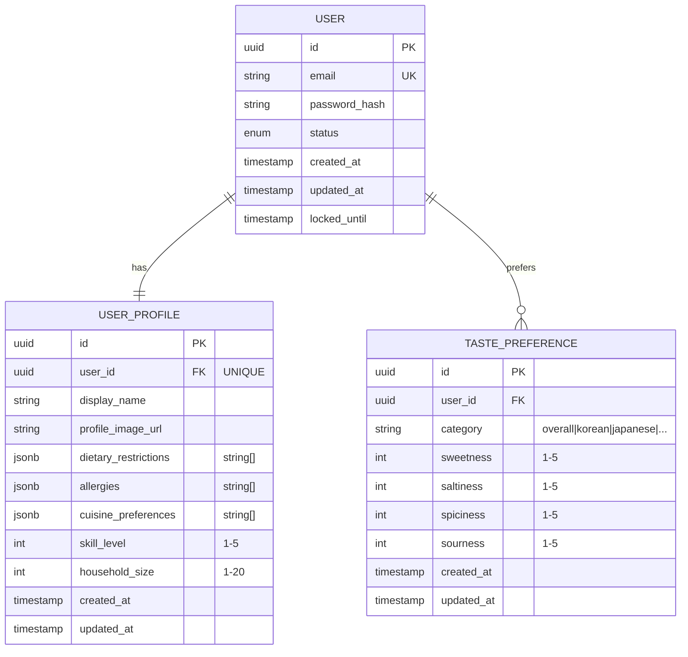

# Data Model: 사용자 프로필 및 취향 설정

**Feature**: 003-user-profile-preferences
**Date**: 2025-12-10

## Entity Relationship Diagram



## Entity Definitions

### 1. UserProfile

**Purpose**: 사용자의 기본 프로필 정보 및 식이/알레르기 설정

**Table**: `user_profiles`

| Column | Type | Constraints | Description |
|--------|------|-------------|-------------|
| id | UUID | PK, DEFAULT uuid_generate_v4() | 프로필 고유 ID |
| user_id | UUID | FK(users.id), UNIQUE, NOT NULL | 사용자 참조 |
| display_name | VARCHAR(50) | NOT NULL, DEFAULT '' | 표시 이름 (1-50자) |
| profile_image_url | VARCHAR(2048) | NULLABLE | 프로필 이미지 URL |
| dietary_restrictions | JSONB | DEFAULT '[]' | 식이 제한 목록 |
| allergies | JSONB | DEFAULT '[]' | 알레르기 목록 |
| cuisine_preferences | JSONB | DEFAULT '[]' | 선호 요리 카테고리 |
| skill_level | INTEGER | CHECK (1 <= skill_level <= 5), NULLABLE | 요리 실력 (1-5) |
| household_size | INTEGER | CHECK (1 <= household_size <= 20), NULLABLE | 가구 인원 수 |
| created_at | TIMESTAMP WITH TIME ZONE | NOT NULL, DEFAULT NOW() | 생성 시각 |
| updated_at | TIMESTAMP WITH TIME ZONE | NOT NULL, DEFAULT NOW() | 수정 시각 |

**Indexes**:
- `idx_user_profiles_user_id` ON (user_id) - UNIQUE

**Relationship**:
- User와 1:1 관계
- User 생성 시 자동 생성 (기본값)

### 2. TastePreference

**Purpose**: 사용자의 맛 취향 프로파일 (전체 및 카테고리별)

**Table**: `taste_preferences`

| Column | Type | Constraints | Description |
|--------|------|-------------|-------------|
| id | UUID | PK, DEFAULT uuid_generate_v4() | 취향 고유 ID |
| user_id | UUID | FK(users.id), NOT NULL | 사용자 참조 |
| category | VARCHAR(20) | NOT NULL, DEFAULT 'overall' | 카테고리 (overall, korean, ...) |
| sweetness | INTEGER | CHECK (1 <= sweetness <= 5), DEFAULT 3 | 단맛 선호도 |
| saltiness | INTEGER | CHECK (1 <= saltiness <= 5), DEFAULT 3 | 짠맛 선호도 |
| spiciness | INTEGER | CHECK (1 <= spiciness <= 5), DEFAULT 3 | 매운맛 선호도 |
| sourness | INTEGER | CHECK (1 <= sourness <= 5), DEFAULT 3 | 신맛 선호도 |
| created_at | TIMESTAMP WITH TIME ZONE | NOT NULL, DEFAULT NOW() | 생성 시각 |
| updated_at | TIMESTAMP WITH TIME ZONE | NOT NULL, DEFAULT NOW() | 수정 시각 |

**Indexes**:
- `idx_taste_preferences_user_id` ON (user_id)
- `idx_taste_preferences_user_category` ON (user_id, category) - UNIQUE

**Relationship**:
- User와 1:N 관계 (카테고리별 별도 레코드)

## Predefined Values (Enum)

### DietaryRestriction

```python
class DietaryRestriction(str, Enum):
    VEGETARIAN = "vegetarian"       # 채식 (유제품/계란 허용)
    VEGAN = "vegan"                 # 비건 (동물성 제품 불가)
    PESCATARIAN = "pescatarian"     # 페스코 (해산물 허용)
    HALAL = "halal"                 # 할랄
    KOSHER = "kosher"               # 코셔
    GLUTEN_FREE = "gluten_free"     # 글루텐 프리
    LACTOSE_FREE = "lactose_free"   # 유당 불내증
    LOW_SODIUM = "low_sodium"       # 저염식
    LOW_SUGAR = "low_sugar"         # 저당식
```

### Allergy

```python
class Allergy(str, Enum):
    PEANUT = "peanut"           # 땅콩
    TREE_NUT = "tree_nut"       # 견과류
    MILK = "milk"               # 우유
    EGG = "egg"                 # 달걀
    WHEAT = "wheat"             # 밀
    SOY = "soy"                 # 대두
    FISH = "fish"               # 생선
    SHELLFISH = "shellfish"     # 갑각류/조개류
    SESAME = "sesame"           # 참깨
```

### CuisineCategory

```python
class CuisineCategory(str, Enum):
    KOREAN = "korean"           # 한식
    JAPANESE = "japanese"       # 일식
    CHINESE = "chinese"         # 중식
    WESTERN = "western"         # 양식
    ITALIAN = "italian"         # 이탈리안
    MEXICAN = "mexican"         # 멕시칸
    THAI = "thai"               # 태국
    VIETNAMESE = "vietnamese"   # 베트남
    INDIAN = "indian"           # 인도
    FUSION = "fusion"           # 퓨전
```

## Validation Rules

### UserProfile

| Field | Rule | Error Message |
|-------|------|---------------|
| display_name | 1 <= len <= 50 | "표시 이름은 1-50자 사이여야 합니다" |
| display_name | strip whitespace | (자동 처리) |
| profile_image_url | valid URL format (http/https) | "유효한 URL 형식이 아닙니다" |
| profile_image_url | len <= 2048 | "URL이 너무 깁니다" |
| dietary_restrictions | all items in DietaryRestriction | "허용되지 않는 식이 제한 값입니다: {value}" |
| allergies | all items in Allergy | "허용되지 않는 알레르기 값입니다: {value}" |
| cuisine_preferences | all items in CuisineCategory | "허용되지 않는 요리 카테고리입니다: {value}" |
| cuisine_preferences | len <= 10 | "선호 요리 카테고리는 최대 10개까지 설정 가능합니다" |
| skill_level | 1 <= value <= 5 or null | "요리 실력은 1-5 사이여야 합니다" |
| household_size | 1 <= value <= 20 or null | "가구 인원 수는 1-20 사이여야 합니다" |

### TastePreference

| Field | Rule | Error Message |
|-------|------|---------------|
| category | in CuisineCategory or "overall" | "허용되지 않는 카테고리입니다" |
| sweetness | 1 <= value <= 5 | "단맛 선호도는 1-5 사이여야 합니다" |
| saltiness | 1 <= value <= 5 | "짠맛 선호도는 1-5 사이여야 합니다" |
| spiciness | 1 <= value <= 5 | "매운맛 선호도는 1-5 사이여야 합니다" |
| sourness | 1 <= value <= 5 | "신맛 선호도는 1-5 사이여야 합니다" |

## State Transitions

### UserProfile Lifecycle

```
[User Created] ──▶ [Profile Created with Defaults]
                          │
                          ▼
                   [Profile Active] ◀─────┐
                          │               │
                          ▼               │
                   [Profile Updated] ─────┘
```

### Default Values (신규 사용자)

```json
{
  "display_name": "",
  "profile_image_url": null,
  "dietary_restrictions": [],
  "allergies": [],
  "cuisine_preferences": [],
  "skill_level": null,
  "household_size": null
}
```

### TastePreference Lifecycle

```
[User Requests Taste Setting] ──▶ [Check Existing for Category]
                                          │
              ┌───────────────────────────┴───────────────────────────┐
              ▼                                                       ▼
       [Category Exists]                                    [Category Not Exists]
              │                                                       │
              ▼                                                       ▼
       [Update Existing]                                      [Create New]
              │                                                       │
              └──────────────────────┬────────────────────────────────┘
                                     ▼
                            [Preference Saved]
```

## Migration Plan

### Step 1: Create user_profiles table

```sql
CREATE TABLE user_profiles (
    id UUID PRIMARY KEY DEFAULT uuid_generate_v4(),
    user_id UUID NOT NULL UNIQUE REFERENCES users(id) ON DELETE CASCADE,
    display_name VARCHAR(50) NOT NULL DEFAULT '',
    profile_image_url VARCHAR(2048),
    dietary_restrictions JSONB NOT NULL DEFAULT '[]',
    allergies JSONB NOT NULL DEFAULT '[]',
    cuisine_preferences JSONB NOT NULL DEFAULT '[]',
    skill_level INTEGER CHECK (skill_level >= 1 AND skill_level <= 5),
    household_size INTEGER CHECK (household_size >= 1 AND household_size <= 20),
    created_at TIMESTAMP WITH TIME ZONE NOT NULL DEFAULT NOW(),
    updated_at TIMESTAMP WITH TIME ZONE NOT NULL DEFAULT NOW()
);

CREATE INDEX idx_user_profiles_user_id ON user_profiles(user_id);
```

### Step 2: Create taste_preferences table

```sql
CREATE TABLE taste_preferences (
    id UUID PRIMARY KEY DEFAULT uuid_generate_v4(),
    user_id UUID NOT NULL REFERENCES users(id) ON DELETE CASCADE,
    category VARCHAR(20) NOT NULL DEFAULT 'overall',
    sweetness INTEGER NOT NULL DEFAULT 3 CHECK (sweetness >= 1 AND sweetness <= 5),
    saltiness INTEGER NOT NULL DEFAULT 3 CHECK (saltiness >= 1 AND saltiness <= 5),
    spiciness INTEGER NOT NULL DEFAULT 3 CHECK (spiciness >= 1 AND spiciness <= 5),
    sourness INTEGER NOT NULL DEFAULT 3 CHECK (sourness >= 1 AND sourness <= 5),
    created_at TIMESTAMP WITH TIME ZONE NOT NULL DEFAULT NOW(),
    updated_at TIMESTAMP WITH TIME ZONE NOT NULL DEFAULT NOW(),
    UNIQUE(user_id, category)
);

CREATE INDEX idx_taste_preferences_user_id ON taste_preferences(user_id);
CREATE UNIQUE INDEX idx_taste_preferences_user_category ON taste_preferences(user_id, category);
```

### Step 3: Create profiles for existing users

```sql
INSERT INTO user_profiles (user_id)
SELECT id FROM users
WHERE id NOT IN (SELECT user_id FROM user_profiles);
```

## SQLAlchemy Models

### UserProfile Model

```python
class UserProfile(Base):
    __tablename__ = "user_profiles"

    id: Mapped[str] = mapped_column(UUID(as_uuid=False), primary_key=True, default=lambda: str(uuid4()))
    user_id: Mapped[str] = mapped_column(UUID(as_uuid=False), ForeignKey("users.id", ondelete="CASCADE"), unique=True, nullable=False)
    display_name: Mapped[str] = mapped_column(String(50), nullable=False, default="")
    profile_image_url: Mapped[str | None] = mapped_column(String(2048), nullable=True)
    dietary_restrictions: Mapped[list] = mapped_column(JSONB, nullable=False, default=list)
    allergies: Mapped[list] = mapped_column(JSONB, nullable=False, default=list)
    cuisine_preferences: Mapped[list] = mapped_column(JSONB, nullable=False, default=list)
    skill_level: Mapped[int | None] = mapped_column(Integer, nullable=True)
    household_size: Mapped[int | None] = mapped_column(Integer, nullable=True)
    created_at: Mapped[datetime] = mapped_column(DateTime(timezone=True), nullable=False, server_default=func.now())
    updated_at: Mapped[datetime] = mapped_column(DateTime(timezone=True), nullable=False, server_default=func.now(), onupdate=func.now())

    # Relationships
    user: Mapped["User"] = relationship("User", back_populates="profile")
```

### TastePreference Model

```python
class TastePreference(Base):
    __tablename__ = "taste_preferences"

    id: Mapped[str] = mapped_column(UUID(as_uuid=False), primary_key=True, default=lambda: str(uuid4()))
    user_id: Mapped[str] = mapped_column(UUID(as_uuid=False), ForeignKey("users.id", ondelete="CASCADE"), nullable=False)
    category: Mapped[str] = mapped_column(String(20), nullable=False, default="overall")
    sweetness: Mapped[int] = mapped_column(Integer, nullable=False, default=3)
    saltiness: Mapped[int] = mapped_column(Integer, nullable=False, default=3)
    spiciness: Mapped[int] = mapped_column(Integer, nullable=False, default=3)
    sourness: Mapped[int] = mapped_column(Integer, nullable=False, default=3)
    created_at: Mapped[datetime] = mapped_column(DateTime(timezone=True), nullable=False, server_default=func.now())
    updated_at: Mapped[datetime] = mapped_column(DateTime(timezone=True), nullable=False, server_default=func.now(), onupdate=func.now())

    # Unique constraint
    __table_args__ = (UniqueConstraint("user_id", "category", name="uq_taste_preferences_user_category"),)

    # Relationships
    user: Mapped["User"] = relationship("User", back_populates="taste_preferences")
```

### User Model Update (relationship 추가)

```python
class User(Base):
    # ... existing fields ...

    # NEW Relationships
    profile: Mapped["UserProfile"] = relationship("UserProfile", back_populates="user", uselist=False, lazy="selectin")
    taste_preferences: Mapped[list["TastePreference"]] = relationship("TastePreference", back_populates="user", lazy="selectin")
```
