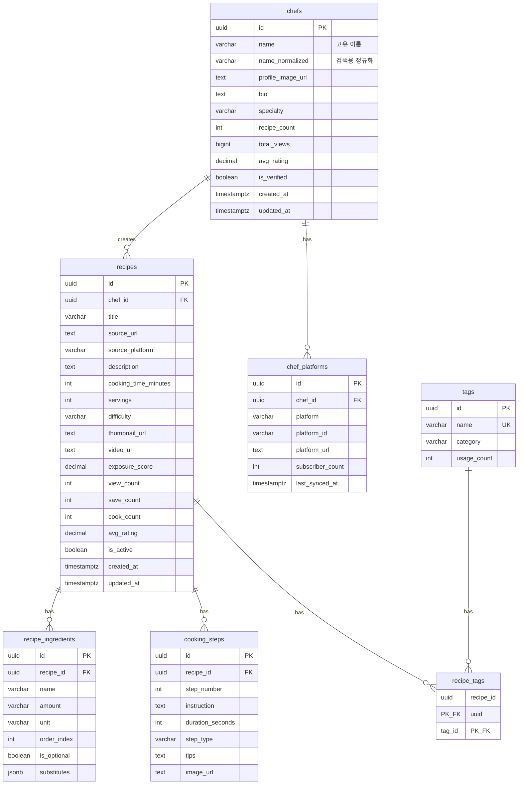

# Data Model: 원본 레시피 기본 CRUD

**Branch**: `004-recipe-basic-crud` | **Date**: 2025-12-10

## Overview

Recipe Service(8001)에서 관리하는 엔티티 모델을 정의한다. 모든 엔티티는 Recipe DB (PostgreSQL)에 저장된다.

---

## Entity Relationship Diagram



---

## Entity Definitions

### Chef (요리사)

레시피를 만든 원작자. 셰프, 유튜버, 인플루언서, 블로거 등.

| 필드 | 타입 | 제약 | 설명 |
|------|------|------|------|
| id | UUID | PK | 고유 식별자 |
| name | VARCHAR(100) | NOT NULL, UNIQUE | 표시 이름 (예: 백종원) |
| name_normalized | VARCHAR(100) | NOT NULL | 검색용 정규화 이름 (소문자, 공백 제거) |
| profile_image_url | TEXT | NULL | 프로필 이미지 URL |
| bio | TEXT | NULL | 자기 소개 |
| specialty | VARCHAR(50) | NULL | 전문 분야 (예: 한식, 양식) |
| recipe_count | INTEGER | DEFAULT 0 | 등록된 레시피 수 |
| total_views | BIGINT | DEFAULT 0 | 총 조회수 |
| avg_rating | DECIMAL(3,2) | DEFAULT 0.00 | 평균 평점 (0.00~5.00) |
| is_verified | BOOLEAN | DEFAULT FALSE | 검증된 요리사 여부 |
| created_at | TIMESTAMPTZ | NOT NULL | 생성 시각 |
| updated_at | TIMESTAMPTZ | NOT NULL | 수정 시각 |

**Indexes**:
- `idx_chefs_name_normalized`: name_normalized (검색용)
- `idx_chefs_recipe_count`: recipe_count DESC (인기 정렬)

---

### ChefPlatform (요리사 플랫폼)

요리사가 활동하는 플랫폼 정보. 한 요리사가 여러 플랫폼을 가질 수 있음.

| 필드 | 타입 | 제약 | 설명 |
|------|------|------|------|
| id | UUID | PK | 고유 식별자 |
| chef_id | UUID | FK, NOT NULL | 요리사 참조 |
| platform | VARCHAR(20) | NOT NULL | 플랫폼 종류 (youtube, instagram, blog, naver) |
| platform_id | VARCHAR(100) | NULL | 플랫폼 내 ID (채널 ID, 계정명) |
| platform_url | TEXT | NOT NULL | 플랫폼 URL |
| subscriber_count | INTEGER | DEFAULT 0 | 구독자/팔로워 수 |
| last_synced_at | TIMESTAMPTZ | NULL | 마지막 동기화 시각 |

**Indexes**:
- `idx_chef_platforms_chef_id`: chef_id
- `idx_chef_platforms_unique`: chef_id + platform (UNIQUE)

**Constraints**:
- platform IN ('youtube', 'instagram', 'blog', 'naver', 'tiktok')

---

### Recipe (원본 레시피)

크롤링으로 수집된 레시피. 읽기 전용으로 사용자 수정 불가.

| 필드 | 타입 | 제약 | 설명 |
|------|------|------|------|
| id | UUID | PK | 고유 식별자 |
| chef_id | UUID | FK, NULL | 요리사 참조 (없을 수 있음) |
| title | VARCHAR(200) | NOT NULL | 레시피 제목 |
| source_url | TEXT | NOT NULL | 원본 URL |
| source_platform | VARCHAR(50) | NOT NULL | 출처 플랫폼 |
| description | TEXT | NULL | 레시피 설명 |
| cooking_time_minutes | INTEGER | NULL | 조리 시간 (분) |
| servings | INTEGER | NULL | 인분 수 |
| difficulty | VARCHAR(20) | NULL | 난이도 (easy, medium, hard) |
| thumbnail_url | TEXT | NULL | 썸네일 이미지 URL |
| video_url | TEXT | NULL | 영상 URL |
| exposure_score | DECIMAL(10,4) | DEFAULT 0 | 노출 점수 (인기도) |
| view_count | INTEGER | DEFAULT 0 | 조회수 |
| save_count | INTEGER | DEFAULT 0 | 저장수 |
| cook_count | INTEGER | DEFAULT 0 | 조리 완료수 |
| avg_rating | DECIMAL(3,2) | DEFAULT 0.00 | 평균 평점 |
| is_active | BOOLEAN | DEFAULT TRUE | 활성 상태 |
| created_at | TIMESTAMPTZ | NOT NULL | 생성 시각 |
| updated_at | TIMESTAMPTZ | NOT NULL | 수정 시각 |

**Indexes**:
- `idx_recipes_chef_id`: chef_id
- `idx_recipes_exposure_score`: exposure_score DESC WHERE is_active = true
- `idx_recipes_created_at`: created_at DESC
- `idx_recipes_source_url`: source_url (UNIQUE)

**Constraints**:
- difficulty IN ('easy', 'medium', 'hard')
- exposure_score >= 0

---

### RecipeIngredient (레시피 재료)

레시피에 필요한 재료 정보.

| 필드 | 타입 | 제약 | 설명 |
|------|------|------|------|
| id | UUID | PK | 고유 식별자 |
| recipe_id | UUID | FK, NOT NULL | 레시피 참조 |
| name | VARCHAR(100) | NOT NULL | 재료명 |
| amount | VARCHAR(50) | NULL | 양 (예: 2, 1/2) |
| unit | VARCHAR(30) | NULL | 단위 (예: 큰술, 개, g) |
| order_index | INTEGER | NOT NULL | 표시 순서 |
| is_optional | BOOLEAN | DEFAULT FALSE | 선택 재료 여부 |
| substitutes | JSONB | NULL | 대체 재료 목록 |

**Indexes**:
- `idx_recipe_ingredients_recipe_id`: recipe_id

---

### CookingStep (조리 단계)

레시피의 조리 과정.

| 필드 | 타입 | 제약 | 설명 |
|------|------|------|------|
| id | UUID | PK | 고유 식별자 |
| recipe_id | UUID | FK, NOT NULL | 레시피 참조 |
| step_number | INTEGER | NOT NULL | 단계 번호 (1부터 시작) |
| instruction | TEXT | NOT NULL | 조리 설명 |
| duration_seconds | INTEGER | NULL | 소요 시간 (초) |
| step_type | VARCHAR(30) | NULL | 단계 유형 (prep, cook, rest) |
| tips | TEXT | NULL | 조리 팁 |
| image_url | TEXT | NULL | 단계 이미지 URL |

**Indexes**:
- `idx_cooking_steps_recipe_id`: recipe_id
- `idx_cooking_steps_order`: recipe_id + step_number (UNIQUE)

---

### Tag (태그)

레시피 분류용 태그. 카테고리별로 구분.

| 필드 | 타입 | 제약 | 설명 |
|------|------|------|------|
| id | UUID | PK | 고유 식별자 |
| name | VARCHAR(50) | NOT NULL, UNIQUE | 태그명 |
| category | VARCHAR(30) | NOT NULL | 카테고리 |
| usage_count | INTEGER | DEFAULT 0 | 사용 횟수 |

**Categories**:
- `cuisine`: 요리 종류 (한식, 양식, 중식, 일식)
- `meal_type`: 식사 유형 (아침, 점심, 저녁, 간식)
- `dish_type`: 음식 유형 (찌개, 볶음, 구이, 튀김)
- `cooking_method`: 조리 방법 (끓이기, 굽기, 볶기)
- `dietary`: 식이 제한 (비건, 저염, 고단백)

**Indexes**:
- `idx_tags_category`: category
- `idx_tags_usage_count`: usage_count DESC

---

### RecipeTag (레시피-태그 연결)

레시피와 태그의 다대다 관계.

| 필드 | 타입 | 제약 | 설명 |
|------|------|------|------|
| recipe_id | UUID | PK, FK | 레시피 참조 |
| tag_id | UUID | PK, FK | 태그 참조 |

**Indexes**:
- `idx_recipe_tags_tag_id`: tag_id (역방향 조회용)

---

## State Transitions

### Recipe.is_active

```
┌─────────┐     DEACTIVATE     ┌───────────┐
│ ACTIVE  │ ────────────────> │ INACTIVE  │
│ (true)  │                   │ (false)   │
└─────────┘ <──────────────── └───────────┘
                REACTIVATE
```

- **ACTIVE → INACTIVE**: 저작권 문제, 삭제 요청, 품질 미달
- **INACTIVE → ACTIVE**: 문제 해결 후 재활성화

### Chef.is_verified

```
┌────────────┐     VERIFY      ┌──────────┐
│ UNVERIFIED │ ────────────> │ VERIFIED │
│ (false)    │               │ (true)   │
└────────────┘               └──────────┘
```

- **UNVERIFIED → VERIFIED**: 관리자 검증 완료

---

## Validation Rules

### Recipe
- title: 1~200자
- cooking_time_minutes: 1~1440 (최대 24시간)
- servings: 1~100
- difficulty: enum(easy, medium, hard)
- exposure_score: >= 0

### Chef
- name: 1~100자
- specialty: 1~50자 (nullable)
- avg_rating: 0.00~5.00

### Ingredient
- name: 1~100자
- amount: 1~50자 (nullable)
- unit: 1~30자 (nullable)
- order_index: >= 0

### Step
- step_number: >= 1
- instruction: 1~2000자
- duration_seconds: >= 0 (nullable)

---

## Database Migrations

### Alembic Migration Files

```python
# migrations/versions/004_recipe_crud_tables.py

def upgrade():
    # 1. chefs 테이블 생성
    op.create_table('chefs', ...)

    # 2. chef_platforms 테이블 생성
    op.create_table('chef_platforms', ...)

    # 3. recipes 테이블에 chef_id FK 추가 (이미 존재 시 ALTER)
    op.add_column('recipes', sa.Column('chef_id', UUID, ForeignKey('chefs.id')))

    # 4. 인덱스 생성
    op.create_index('idx_recipes_exposure_score', 'recipes', ['exposure_score'])
    ...

def downgrade():
    # 역순으로 제거
    ...
```
