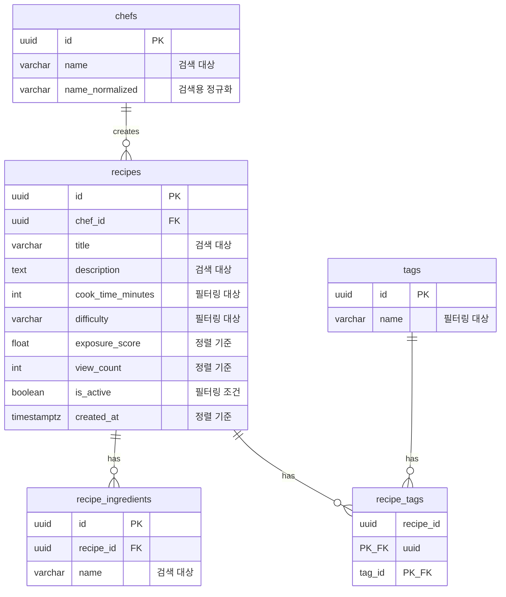

# Data Model: 원본 레시피 검색

**Branch**: `005-recipe-search` | **Date**: 2025-12-10

## Overview

레시피 검색 기능은 SPEC-004에서 정의된 기존 테이블들을 활용합니다. 새로운 테이블 생성 없이 인덱스 추가와 쿼리 최적화만 수행합니다.

---

## Entity Relationship (검색 관련)



---

## Existing Tables (SPEC-004)

검색 기능에서 사용하는 기존 테이블들입니다. 상세 스키마는 `specs/004-recipe-basic-crud/data-model.md` 참조.

### recipes

| 필드 | 타입 | 검색/필터 역할 |
|------|------|--------------|
| id | UUID | 커서 페이지네이션 보조 키 |
| chef_id | UUID | 요리사 필터 (`chef_id=...`) |
| title | VARCHAR(200) | 키워드 검색 대상 |
| description | TEXT | 키워드 검색 대상 |
| cook_time_minutes | INTEGER | 조리시간 필터 (`max_cook_time`) |
| difficulty | VARCHAR(20) | 난이도 필터 (`difficulty`) |
| exposure_score | FLOAT | 기본 정렬 기준 (relevance) |
| view_count | INTEGER | 인기순 정렬 기준 (popularity) |
| is_active | BOOLEAN | 활성 레시피만 검색 |
| created_at | TIMESTAMPTZ | 최신순 정렬 기준 (latest) |

### recipe_ingredients

| 필드 | 타입 | 검색/필터 역할 |
|------|------|--------------|
| recipe_id | UUID | 레시피 조인 키 |
| name | VARCHAR(100) | 키워드 검색 대상 (재료명) |

### chefs

| 필드 | 타입 | 검색/필터 역할 |
|------|------|--------------|
| id | UUID | 요리사 필터 조인 키 |
| name | VARCHAR(100) | 키워드 검색 대상 (요리사명) |
| profile_image_url | VARCHAR(500) | 검색 결과에 포함 |

### tags

| 필드 | 타입 | 검색/필터 역할 |
|------|------|--------------|
| id | UUID | 태그 필터 조인 키 |
| name | VARCHAR(50) | 태그 필터 (`tag=...`) |

### recipe_tags

| 필드 | 타입 | 검색/필터 역할 |
|------|------|--------------|
| recipe_id | UUID | 레시피 조인 키 |
| tag_id | UUID | 태그 조인 키 |

---

## New Indexes (검색 최적화)

검색 성능을 위해 추가가 필요한 인덱스들입니다.

### 정렬용 복합 인덱스

```sql
-- 조리시간 정렬용 (cook_time)
CREATE INDEX idx_recipes_cook_time_sort
ON recipes (cook_time_minutes ASC NULLS LAST, id ASC)
WHERE is_active = TRUE;

-- 인기순 정렬용 (popularity)
CREATE INDEX idx_recipes_view_count_sort
ON recipes (view_count DESC, id DESC)
WHERE is_active = TRUE;

-- 최신순 정렬용 (latest) - 기존 인덱스 확장
CREATE INDEX idx_recipes_created_at_sort
ON recipes (created_at DESC, id DESC)
WHERE is_active = TRUE;
```

### 검색용 텍스트 패턴 인덱스

```sql
-- 재료명 LIKE 검색 최적화
CREATE INDEX idx_recipe_ingredients_name_pattern
ON recipe_ingredients (name varchar_pattern_ops);

-- 요리사명 LIKE 검색 최적화
CREATE INDEX idx_chefs_name_pattern
ON chefs (name varchar_pattern_ops);

-- 레시피 제목 LIKE 검색 최적화 (선택적)
CREATE INDEX idx_recipes_title_pattern
ON recipes (title varchar_pattern_ops)
WHERE is_active = TRUE;
```

### 필터링용 인덱스

```sql
-- 난이도 필터용
CREATE INDEX idx_recipes_difficulty
ON recipes (difficulty)
WHERE is_active = TRUE;

-- 조리시간 범위 필터용
CREATE INDEX idx_recipes_cook_time_range
ON recipes (cook_time_minutes)
WHERE is_active = TRUE AND cook_time_minutes IS NOT NULL;
```

---

## Query Models (Pydantic Schemas)

### SearchQueryParams (요청)

```python
class SearchQueryParams(BaseModel):
    """검색 API 요청 파라미터"""

    q: str | None = Field(
        default=None,
        max_length=100,
        description="검색 키워드 (제목, 설명, 재료명, 요리사명)"
    )
    difficulty: Literal["easy", "medium", "hard"] | None = Field(
        default=None,
        description="난이도 필터"
    )
    max_cook_time: int | None = Field(
        default=None,
        ge=1,
        le=1440,
        description="최대 조리시간 (분)"
    )
    tag: str | None = Field(
        default=None,
        max_length=50,
        description="태그 필터"
    )
    chef_id: UUID | None = Field(
        default=None,
        description="요리사 ID 필터"
    )
    sort: Literal["relevance", "latest", "cook_time", "popularity"] = Field(
        default="relevance",
        description="정렬 기준"
    )
    cursor: str | None = Field(
        default=None,
        max_length=200,
        description="페이지네이션 커서"
    )
    limit: int = Field(
        default=20,
        ge=1,
        le=100,
        description="결과 개수"
    )
```

### SearchResultItem (응답 아이템)

```python
class ChefSummary(BaseModel):
    """검색 결과에 포함되는 요리사 정보"""
    id: UUID
    name: str
    profile_image_url: str | None = None


class TagSummary(BaseModel):
    """검색 결과에 포함되는 태그 정보"""
    id: UUID
    name: str
    category: str


class SearchResultItem(BaseModel):
    """검색 결과 레시피 아이템"""
    id: UUID
    title: str
    description: str | None = None
    thumbnail_url: str | None = None
    prep_time_minutes: int | None = None
    cook_time_minutes: int | None = None
    difficulty: str | None = None
    exposure_score: float
    chef: ChefSummary | None = None
    tags: list[TagSummary] = []
    created_at: datetime
```

### SearchResult (응답)

```python
class SearchResult(BaseModel):
    """검색 API 응답"""
    items: list[SearchResultItem]
    next_cursor: str | None = None
    has_more: bool = False
    total_count: None = None  # 항상 null (성능 최적화)
```

---

## Cursor Encoding

커서 기반 페이지네이션을 위한 커서 인코딩 형식입니다.

### 커서 구조

```python
class CursorData(BaseModel):
    """커서에 인코딩되는 데이터"""
    sort: str  # 정렬 기준
    value: float | int | str  # 정렬 필드 값
    id: str  # 레시피 ID (tie-breaker)
```

### 정렬별 커서 필드

| 정렬 | 커서 필드 | 타입 |
|------|----------|------|
| relevance | (exposure_score, id) | (float, str) |
| latest | (created_at, id) | (str, str) |
| cook_time | (cook_time_minutes, id) | (int, str) |
| popularity | (view_count, id) | (int, str) |

### 인코딩/디코딩

```python
import base64
import json
from datetime import datetime

def encode_cursor(sort: str, value: any, recipe_id: str) -> str:
    """커서 인코딩"""
    if isinstance(value, datetime):
        value = value.isoformat()
    data = {"s": sort, "v": value, "i": recipe_id}
    return base64.urlsafe_b64encode(json.dumps(data).encode()).decode()


def decode_cursor(cursor: str) -> tuple[str, any, str]:
    """커서 디코딩"""
    data = json.loads(base64.urlsafe_b64decode(cursor.encode()).decode())
    return data["s"], data["v"], data["i"]
```

---

## Cache Key Schema

검색 결과 캐싱을 위한 Redis 키 스키마입니다.

### 캐시 키 패턴

```
search:recipes:{hash}
```

### 해시 계산

```python
import hashlib
import json

def get_search_cache_key(params: SearchQueryParams) -> str:
    """검색 파라미터로 캐시 키 생성"""
    cache_params = {
        "q": params.q or "",
        "d": params.difficulty or "",
        "t": params.max_cook_time or 0,
        "tag": params.tag or "",
        "c": str(params.chef_id) if params.chef_id else "",
        "s": params.sort,
        "cur": params.cursor or "",
        "l": params.limit,
    }
    hash_input = json.dumps(cache_params, sort_keys=True)
    hash_value = hashlib.md5(hash_input.encode()).hexdigest()[:16]
    return f"search:recipes:{hash_value}"
```

### 캐시 설정

| 설정 | 값 |
|------|-----|
| TTL | 300초 (5분) |
| 무효화 이벤트 | RecipeCreated, RecipeUpdated, RecipeDeleted |
| 무효화 방식 | SCAN + DEL 패턴 매칭 |

---

## Database Migrations

### 마이그레이션 파일

```python
# migrations/versions/005_recipe_search_indexes.py

def upgrade():
    # 정렬용 복합 인덱스
    op.create_index(
        'idx_recipes_cook_time_sort',
        'recipes',
        ['cook_time_minutes', 'id'],
        postgresql_where=text('is_active = TRUE'),
    )
    op.create_index(
        'idx_recipes_view_count_sort',
        'recipes',
        [text('view_count DESC'), text('id DESC')],
        postgresql_where=text('is_active = TRUE'),
    )
    op.create_index(
        'idx_recipes_created_at_sort',
        'recipes',
        [text('created_at DESC'), text('id DESC')],
        postgresql_where=text('is_active = TRUE'),
    )

    # 텍스트 패턴 인덱스
    op.create_index(
        'idx_recipe_ingredients_name_pattern',
        'recipe_ingredients',
        [text("name varchar_pattern_ops")],
    )
    op.create_index(
        'idx_chefs_name_pattern',
        'chefs',
        [text("name varchar_pattern_ops")],
    )

    # 필터링 인덱스
    op.create_index(
        'idx_recipes_difficulty',
        'recipes',
        ['difficulty'],
        postgresql_where=text('is_active = TRUE'),
    )
    op.create_index(
        'idx_recipes_cook_time_range',
        'recipes',
        ['cook_time_minutes'],
        postgresql_where=text('is_active = TRUE AND cook_time_minutes IS NOT NULL'),
    )


def downgrade():
    op.drop_index('idx_recipes_cook_time_range')
    op.drop_index('idx_recipes_difficulty')
    op.drop_index('idx_chefs_name_pattern')
    op.drop_index('idx_recipe_ingredients_name_pattern')
    op.drop_index('idx_recipes_created_at_sort')
    op.drop_index('idx_recipes_view_count_sort')
    op.drop_index('idx_recipes_cook_time_sort')
```

---

## Validation Rules

### 검색 파라미터

| 필드 | 규칙 |
|------|------|
| q | 1~100자, 공백 정규화, 빈 문자열은 null 처리 |
| difficulty | enum(easy, medium, hard) |
| max_cook_time | 1~1440 (분) |
| tag | 1~50자 |
| chef_id | UUID 형식 |
| sort | enum(relevance, latest, cook_time, popularity) |
| cursor | base64 인코딩, 최대 200자 |
| limit | 1~100, 기본값 20 |

### 에러 응답

| 조건 | 상태 코드 | 에러 코드 |
|------|----------|-----------|
| 검색어 100자 초과 | 400 | INVALID_SEARCH_QUERY |
| 유효하지 않은 정렬 옵션 | 400 | INVALID_SORT_OPTION |
| 음수 조리시간 | 400 | INVALID_FILTER_VALUE |
| 잘못된 커서 형식 | 400 | INVALID_CURSOR |
| 잘못된 UUID 형식 | 400 | INVALID_FILTER_VALUE |
